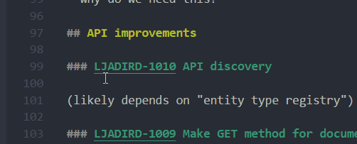
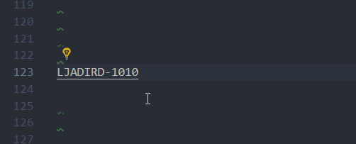

# vscjira README

to setup the extension call **VSJira: Configure**. (and reload the vscode window **Ctrl + R**)

## Features

Makes jira information easier to access in markdowns.

1. jira task names (example.: TST-123) are treated as links and can be control clicked to follow them
2. hovering over a task name opens a hover with its summary
    
3. expanding a task name into a summary with a link with code actions (**ctrl + .**)
    

## Requirements

- read access to the jira tasks through the jira api

## Extension Settings

To set everything run the command **VSJira: Configure**. This will be written to the user configuration.

## Known Issues

- once setting configuration for jira a reload of the window is required (**Ctrl + R**)

## Release Notes

### 1.0.0

Initial release of ...
